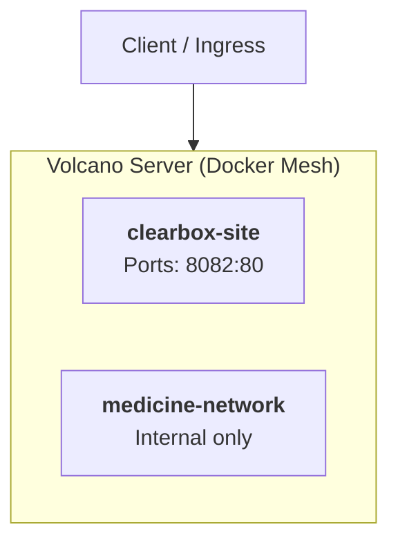

# Clearbox Site Architecture & Topology

> *Auto-generated on every push via GitHub Actions. Do not edit manually.*  
> **Last Generated:** 2026-09-22 09:57:34 UTC

## Service Mesh Overview

---

## Container Specifications

| Container Name | Service Name | Mapped Ports | Volumes | Memory Limit |
| :--- | :--- | :--- | :--- | :--- |
| `clearbox-site` | `clearbox-site` | `8082:80` | `"8082:80"` | `unlimited` |
| `medicine-network` | `medicine-network` | `None` | `None` | `unlimited` |
